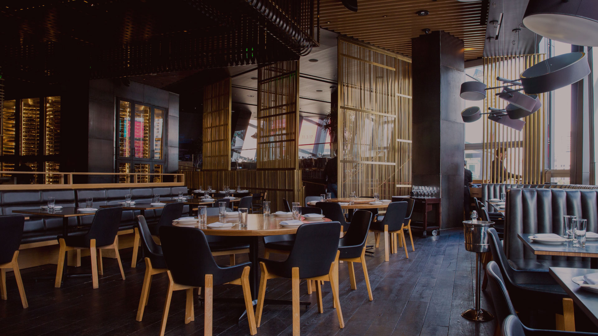
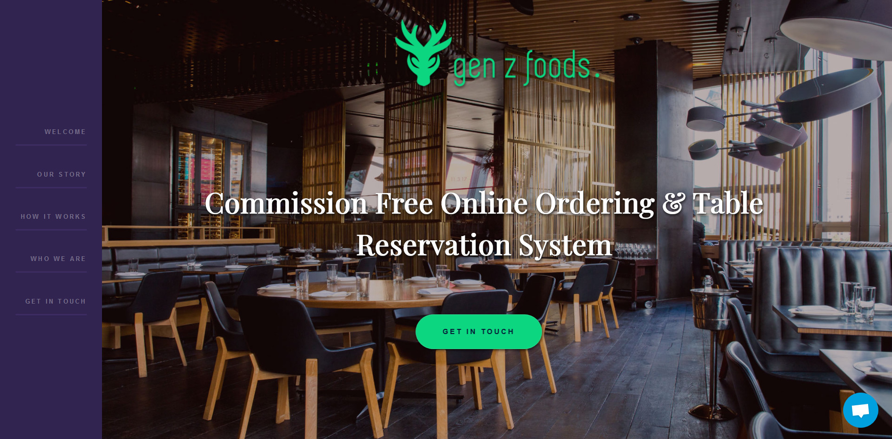

# Gen-z Foods

built using Gatsby.js V2 

For an overview of the project structure please refer to the [Gatsby documentation - Building with Components](https://www.gatsbyjs.org/docs/building-with-components/).

## Screenshot

